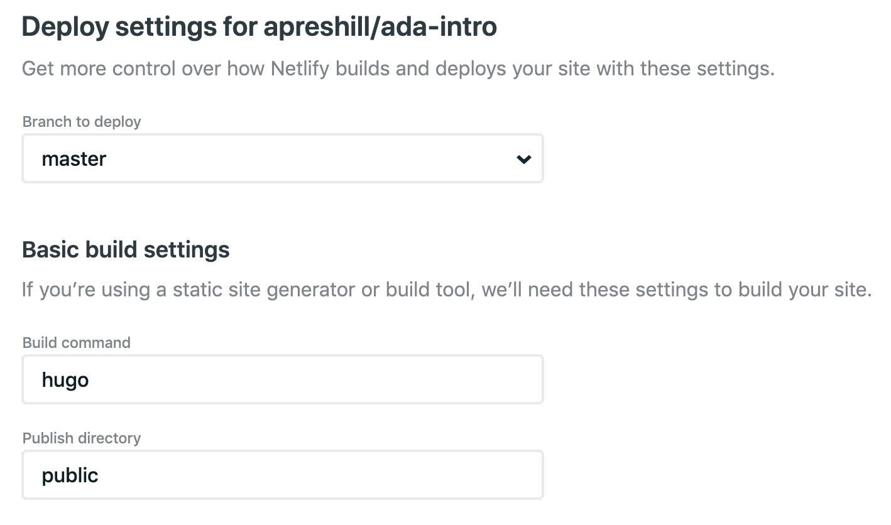

```{r, include = FALSE}
knitr::opts_chunk$set(
  collapse = TRUE,
  comment = "#>"
)
```

This vignette describes the process of deployment, how you get your hugodown website off your local computer and on to the internet for everyone to see. There are many possible ways to deploy a hugodown site. I recommend two:

* With [netlify](https://www.netlify.com), to publish to a website.

* With RStudio Connect, if you want to publish to a connect server within your
  company.

(In either case, I assume you're already familiar with the basics of Git and GitHub. If you're not, you may need to start with [Happy Git and GitHub for the R user](http://happygitwithr.com/) by Jenny Bryan.)

## Netlify

(Adapted from [A Spoonful of Hugo: The netlify.toml File](https://alison.rbind.io/post/2017-06-12-up-and-running-with-blogdown/#deploy-in-netlify) by Alison Hill, with permission.)

First, create an account if you don't already have one:

1.  Navigate to [Netlify](https://www.netlify.com/) and click on the *Sign Up* link. 

    {width=400}

1.  Sign up with *GitHub* to connect your GitHub and Netlify accounts.

    {width=400}

    If you use a different version control service, select GitLab or 
    BitBucket instead.
    
Then create a netlify site for your GitHub repo:

1.  On the netlify website, go *New Site from Git* and pick your repo. 
    You'll be prompted to fill in these fields. They are probably already 
    filled in correctly for you:

    {width=400}
    
    Leave the advanced settings as is, and click deploy site. (This won't
    work but we'll fix it momentarily.)
    
Version mismatches are the biggest source of failures when deploying with netlify, so next we need to set up a `netlify.toml` file that tells netlify exactly what version of hugo to use. 

1.  Check you have a `_hugodown.yaml` file that contains `hugo_version: 0.66.0`
    or similar. It's added automatically you created your site with a hugodown
    helper; you'll need to add it yourself if you've created the site another
    way.
    
1.  Run `hugodown::use_netlify_toml()`, check the new `netlify.toml` in, 
    commit, and push to Github.

Now return to [netlify](https://app.netlify.com), and look in the deploy log. You should see entries like:

```
10:00:42 PM: Build ready to start
10:00:43 PM: build-image version: 8e315e54bc4032a32e73290be556cde4f8348c12
...
10:00:56 PM: Found netlify.toml. Overriding site configuration
...
10:01:02 PM: Installing Hugo 0.68.3
10:01:02 PM: Hugo Static Site Generator v0.68.3-157669A0 linux/amd64 BuildDate: 2020-03-24T12:05:34Z
...
10:01:04 PM: Executing user command: hugo
10:01:04 PM: Building sites …
...
10:01:23 PM: Site is live
```

Success!

## RStudio connect

* Need `relativeURLS=true` in your `config.toml`.

## Other options


### GitHub pages

You'll need to make two changes to your site:

* Run `file.create("static/.nojekyll")`. This ensures that GitHub pages knows
  that you're using a regular HTML website, not a jekyll website (jekyll is 
  GitHub's own blogging system).
  
* If you have a custom domain name, create `static/CNAME` containing your
  domain name (just `tidyverse.org`, not `https://tidyverse.org`). Note
  that setting a custom domain name in the admin settings on your GitHub repo
  will not work because it will get blown away.

* If you don't have a custom domain, you'll need `relativeURLS=true` in your
  `config.toml`.

